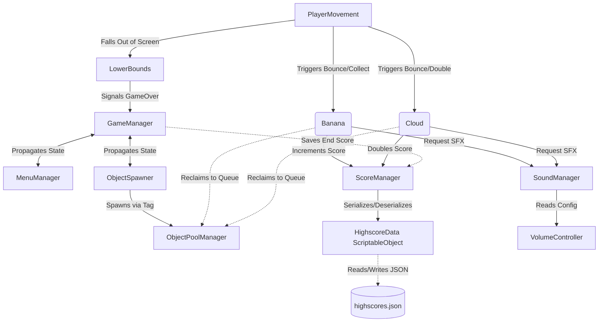

# 🐒 Monkey Jump 2D

[](https://cloxygen.itch.io/monkey-jump)
[](https://unity.com/)
[](https://docs.microsoft.com/en-us/dotnet/csharp/)
[](LICENSE)

An endless vertical platformer developed in Unity 2D. Control the player character, scale new heights, bounce off falling bananas, and high-flying clouds to achieve the ultimate high score! The game features a dynamic difficulty ramp, high-performance object pooling, decoupled events-driven architecture, and local JSON-based high-score persistence.

> 🎮 **[Play the game instantly in your browser on itch.io!](https://cloxygen.itch.io/monkey-jump)**


---

## 📖 Table of Contents
1. [🎮 Gameplay Mechanics](#-gameplay-mechanics)
2. [⚙️ Architecture & Design Patterns](#-architecture--design-patterns)
3. [📂 Project Structure](#-project-structure)
4. [🚀 Getting Started](#-getting-started)
5. [🕹️ How to Play](#%EF%B8%8F-how-to-play)
6. [🛠️ Development Details](#%EF%B8%8F-development-details)
7. [📄 License](#-license)

---

## 🎮 Gameplay Mechanics

### 🏃 Player Movement
The player's horizontal position is directly controlled by the **mouse cursor**, allowing for high-precision drift. Vertical movement is physics-driven:
- **Jumping**: Click the **Left Mouse Button (LMB)** while grounded to jump.
- **Bouncing**: Landing on Bananas or Clouds triggers an automatic vertical bounce, boosting the player upwards.
- **Landing Shake**: Landing on the ground triggers a dynamic screen shake, bringing immediate tactile feedback.

### 🍌 Falling Bananas (Pickups & Combo Platforms)
Bananas act as the primary platform mechanics. They are spawned dynamically above the player and fall downward:
- **Combo Scoring**: Bouncing on a banana increments your score. Each consecutive banana collected increases the points-per-banana increment (e.g. +10, +20, +30, etc.), rewarding consistent play.
- **Ramping Difficulty**: To keep players challenged, the spawning mechanics scale over time:
  - **Horizontal Variance**: As you climb, the horizontal spawning spread increases, scattering bananas wider.
  - **Scale Scaling**: The physical size of the bananas dynamically shrinks (clamped between `100%` down to `30%`), making them significantly harder targets as your score climbs!

### ☁️ Gliding Clouds (Multiplier Platforms)
Clouds act as special platforms that drift horizontally across the screen, bouncing off boundaries:
- **Score Doubler**: Landing on a cloud triggers a massive **x2 Multiplier**, doubling your current total score!
- **Tactical Strategy**: Collecting bananas to build a huge combo score, and then landing on a cloud to double it, is the key to breaking high score records.

### ⚠️ Lower Bounds & Fail State
A trigger volume represents the "bottomless pit". It follows at a set distance (`towDistance`) underneath the camera. If the player misses a banana platform and falls below the screen edge:
- The player hits the `LowerBounds`.
- The game state transitions immediately to `GameOver`.
- Control interfaces disable, and the camera smooth-damps back to its starting coordinate.

---

## ⚙️ Architecture & Design Patterns

The project is built on an enterprise-ready, decoupled, singleton-driven architecture. Components communicate using **UnityEvents** to keep dependency graphs clean and manageable.

### 🧩 System Architecture Diagram



### 🎛️ Key Subsystems

#### 1. `GameManager`
Acts as the central finite state machine (FSM). It defines states using the `State` enum:
- `StartMenu`: UI displays the high score screen and start button. Controls are disabled.
- `Playing`: Gameplay loop is active. Player movement is enabled and obstacles spawn.
- `Paused`: Game halts.
- `GameOver`: Controls freeze, player drops, final scores are evaluated, and menus transition.

#### 2. `ObjectPoolManager`
Garbage Collection (GC) spikes are the enemy of smooth mobile/web game experiences. The `ObjectPoolManager` pre-instantiates pools of key assets (such as Bananas, Clouds, Explode Particles, and Floating Popup Text) inside FIFO `Queue<GameObject>` collections, instantly reusing them during high-frequency spawning cycles and avoiding runtime `Instantiate` and `Destroy` performance costs.

#### 3. `ObjectSpawner`
Controls obstacle placement. It dynamically tracks the player's height relative to the main camera, pre-spawning bananas and clouds up to a buffer distance. It implements the difficulty formulas, increasing horizontal distribution and decreasing object scale as the spawn counters scale.

#### 4. `ScoreManager` & `HighscoreData`
Manages in-game score arithmetic and persistence:
- **Dynamic Incrementing**: Accumulates points and builds the combo multiplier multiplier.
- **ScriptableObject Persistence**: Uses the `HighscoreData` ScriptableObject container to store a sorted descending list of the top 10 scores.
- **Local File I/O**: Reads and writes scores locally via JSON representation to standard local storage (`Application.persistentDataPath/highscores.json`), ensuring scores are secure and retained across app closures.

#### 5. `SoundManager` & `VolumeController`
Plays sounds using one-shot instances or looping controllers. It pulls current volume scales dynamically from the `VolumeController` for custom volume sliders and menu-driven adjustments.

---

## 📂 Project Structure

A clean, modular organization of project assets:

```text
Assets/
├── Animations/           # Player animators, clips, and platform animations
├── Prefabs/              # Pre-configured objects (Player, Banana, Cloud, SFX)
├── Scenes/               # Game scenes (Main Menu & Main Gameplay Scene)
├── Scripts/              # All game logic (documented below)
├── Sounds/               # Sound effects (.wav/.mp3)
├── Sprites/              # 2D Sprite sheets, characters, and UI icons
└── TextMesh Pro/         # Text styles and visual typography
```

### 📜 Core Script Directory

Below is the directory mapping of the C# scripts in [Assets/Scripts](Assets/Scripts):

| Script | Purpose / Core Responsibility | Key Methods / API |
| :--- | :--- | :--- |
| [PlayerMovement.cs](Assets/Scripts/PlayerMovement.cs) | Follows mouse, applies 2D gravity, triggers jumps, bounces, and manages player animator fields. | `Bounce()`, `IsGrounded()`, `FollowCursor()` |
| [Banana.cs](Assets/Scripts/Banana.cs) | Controls falling banana obstacles, handles collection triggers, score additions, and fade animations. | `Fall()`, `OnTriggerEnter2D()`, `ResetObject()` |
| [Cloud.cs](Assets/Scripts/Cloud.cs) | Drifts horizontally, reverses at edges, handles double-score multiplier and particle triggers. | `MoveHorizontal()`, `SetDirection()`, `ResetObject()` |
| [ObjectSpawner.cs](Assets/Scripts/ObjectSpawner.cs) | Dynamically spawns platforms based on camera height. Configures difficulty scaling (variance, scale). | `Initialize()`, `SpawnBanana()`, `SpawnCloud()` |
| [ObjectPoolManager.cs](Assets/Scripts/ObjectPoolManager.cs) | Handles creation, retrieval, and recycling of pooled game objects via string-based queues. | `SpawnObject()`, `DespawnObject()`, `FillPool()` |
| [GameManager.cs](Assets/Scripts/GameManager.cs) | Global state manager driving menus, control overrides, and event dispatchers. | `SetStatePlay()`, `SetStateStart()` |
| [ScoreManager.cs](Assets/Scripts/ScoreManager.cs) | Computes bananas/clouds points, manages active scoring, and interfaces with high-score storage. | `IncrementScore()`, `DoubleScore()`, `CheckStateAndSaveScore()` |
| [HighscoreData.cs](Assets/Scripts/HighscoreData.cs) | ScriptableObject handling descending high-score sorting and JSON local disk saving. | `AddNewHighscore()`, `SaveHighscoresToPersistentStorage()` |
| [CameraFollowPlayer.cs](Assets/Scripts/CameraFollowPlayer.cs) | Clamped vertical-only camera follow utilizing `SmoothDamp` to tracking player ascent. | `ClampVerticalPosition()`, `CheckStateAndEnableFollowing()` |
| [LowerBounds.cs](Assets/Scripts/LowerBounds.cs) | Safety net moving below the camera viewport, triggering GameOver on player entrance. | `moveUpWithCamera()`, `OnTriggerEnter2D()` |
| [SoundManager.cs](Assets/Scripts/SoundManager.cs) | Registers game audio clips into direct-lookup collections for seamless event calls. | `PlaySound()`, `LoopSound()` |
| [MenuManager.cs](Assets/Scripts/MenuManager.cs) | Configures active canvasses (Main Menu, High Scores, Game Over) based on current state. | `CheckStateAndShowMenu()`, `SetStateHiscores()` |

---

## 🚀 Getting Started

### 📋 Prerequisites
- **Unity Editor**: `Unity 6.3` or higher.
- **TextMesh Pro**: Requires **TextMesh Pro (TMP)** to render the typography and UI elements correctly. Ensure TMP Essentials are imported if prompted.
- **Git LFS**: Ensure Git Large File Storage (LFS) is installed before cloning (as this project tracks sprite sheets, fonts, and audio clips using LFS).

### ⚙️ Installation
1. Install Git LFS (if not already installed):
   ```bash
   git lfs install
   ```
2. Clone the repository:
   ```bash
   git clone https://github.com/your-username/banana-climb-2d.git
   ```
3. Open the project root folder in **Unity Hub** (version 3.0+).
4. Select the target LTS editor version and let Unity compile files and initialize packages.
5. In the Project pane, navigate to `Assets/Scenes/` and double-click `SampleScene.unity` to open the primary workspace.

---

## 🕹️ How to Play

1. Press **Play** in the Unity Editor.
2. In the **Main Menu**, select **Start Game** (or view the **High Scores** list).
3. **Move Left/Right**: Guide the player character by moving your **Mouse cursor** across the screen.
4. **Jump**: Press the **Left Mouse Button (LMB)** when grounded to execute a start jump.
5. **Collect & Ascend**:
   - Bounce on falling **Bananas** to add score points and gain height.
   - Snag **Clouds** drifting across the viewport to **Double** your current score and bounce even higher!
6. **Survive**: Do not let the character fall below the screen boundaries! If you miss the platforms and hit the bottom threshold, it is Game Over.

---

## 📄 License
This project is open-source software licensed under the [MIT License](LICENSE).
